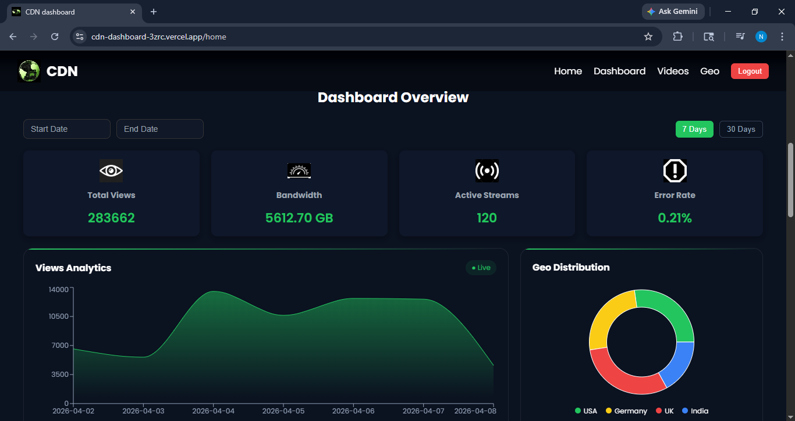
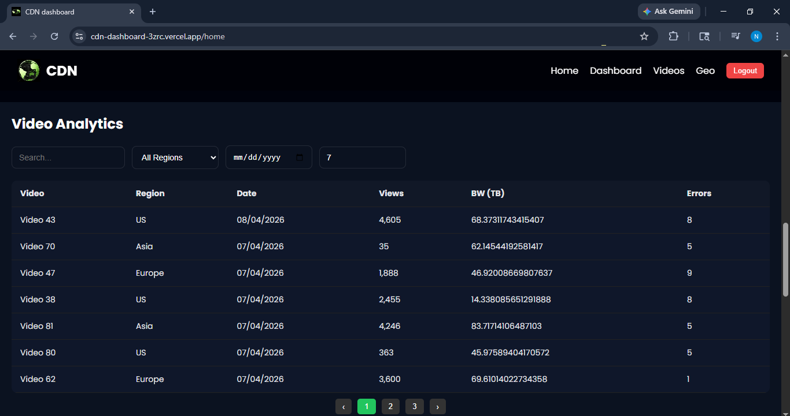
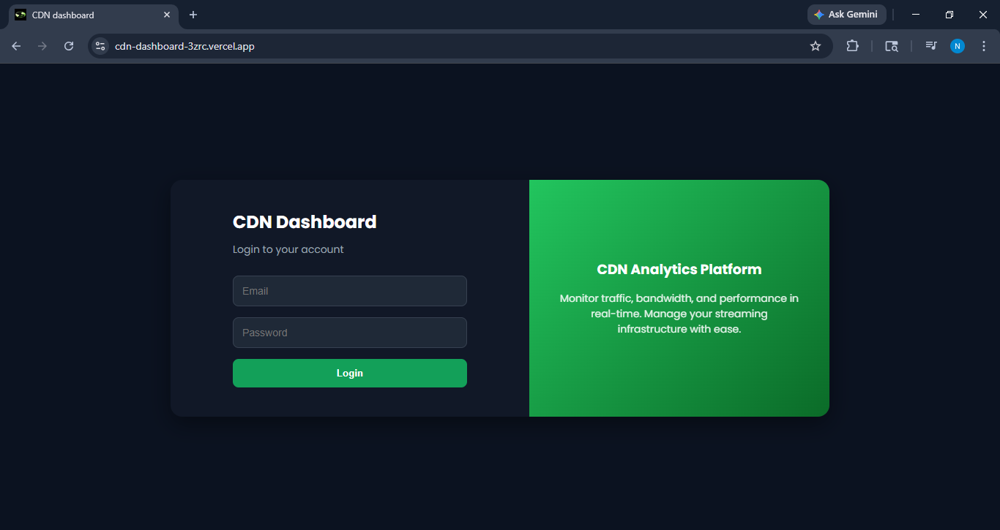

#  CDN Analytics Dashboard

This project is a simple yet powerful **CDN (Content Delivery Network) Analytics Dashboard** built to monitor video performance, traffic trends, and system usage in a clean and interactive way.

The goal of this project is to make analytics easy to understand through **visual charts, filters, and a responsive UI**.

---

##  What this project does

* Lets users securely log in using JWT authentication
* Shows overall CDN performance like:

  * Total views
  * Bandwidth usage
  * Active streams
  * Error rate
* Displays **interactive charts** for better insights
* Provides a **video analytics table** with search, filters, sorting, and pagination
* Works smoothly on both desktop and mobile devices

---

##  Why I built this

Understanding CDN performance can be confusing when dealing with raw data.
So I built this dashboard to:

* Simplify analytics using visuals 
* Practice full-stack development (React + Node.js + MongoDB)
* Learn real-world concepts like authentication, APIs, and data filtering

---

##  Tech Stack

### Frontend

* React (Vite)
* Axios
* Recharts (for charts)
* React Datepicker
* Custom CSS (responsive design)

### Backend

* Node.js
* Express.js
* MongoDB (Mongoose)

### Authentication

* JWT (JSON Web Tokens)

---

##  Project Structure

```bash
cdn-dashboard/
├── frontend/
│   ├── src/
│   │   ├── pages/        # Dashboard, Videos, Login
│   │   ├── components/   # Reusable UI components
│   │   ├── services/     # API calls
│   │   └── assets/       # Images/icons
│
├── backend/
│   ├── controllers/
│   ├── routes/
│   ├── models/
│   ├── config/
│   └── server.js
```

---

## ⚙️ How to run this project

### 1. Clone the repo

```bash
git clone https://github.com/NivedithaUnni/cdn-dashboard.git
cd cdn-dashboard
```

---

### 2. Setup backend

```bash
cd backend
npm install
```

Create a `.env` file:

```
MONGO_URI=your_mongodb_connection
PORT=5000
JWT_SECRET=your_secret
JWT_EXPIRES_IN=1d
```

Run backend:

```bash
npm run dev
```

---

### 3. Setup frontend

```bash
cd frontend
npm install
```

Create a `.env` file:

```
VITE_API_BASE_URL=http://localhost:5000/api
```

Run frontend:

```bash
npm run dev
```

---

##  Features in detail

### 🔹 Dashboard

* View analytics summary at a glance
* Switch between **7 days / 30 days trends**
* Filter data using date picker
* Clean charts for better understanding

### 🔹 Video Analytics

* Search videos easily
* Filter by region and date
* Sort data dynamically
* Pagination for better performance

### 🔹 Authentication

* Secure login system
* Token stored in localStorage
* Auto redirect if unauthorized

---

##  Screenshots

### Dashboard Overview


---

### Video Analytics


---

### Login Page



---

##  Deployment

You can deploy this project using:

* Frontend → Vercel 
* Backend → Render

---

##  Future Improvements

* Real-time updates (WebSockets)
* Role-based access (Admin/User)
* Export analytics reports
* More advanced filters

---

##  Author

**Niveditha Unni**

---

##  Final Note

This project was built as a learning experience to understand how real-world dashboards work.
It combines backend APIs, frontend UI, and data visualization into one complete system.


